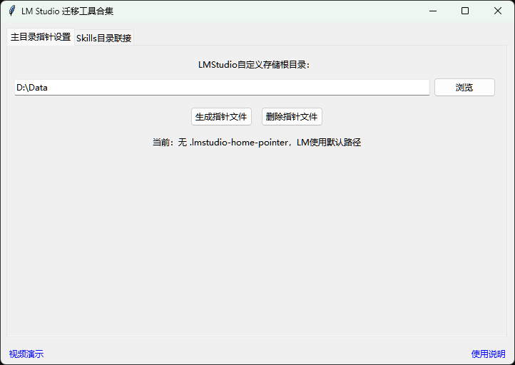

# LM Studio 迁移工具合集 / LM Studio Migration Tools Collection
[English](#english) | [中文](#chinese)

---

### 项目简介
用于迁移LM Studio的C:\Users\用户名\.lmstudio的文件和链接skills到用户自定义路径，达到节省系统盘空间的效果。本项目界面、代码由豆包（字节跳动 Seed 大模型）辅助生成，由开发者手动调试、整合、优化并开源发布。

### 使用方法
1. 安装[Python](https://www.python.org/downloads/)（记得勾选 tcl/tk and IDLE）
2. 双击打开 `lm_tool_ collection.py`
3. 运行程序：首先主目录指针设置自定义储存根目录生成指针文件，在这个路径后面加上”\skills“后复制，然后切换到Skills目标联接，粘贴到目标目录再点击生成目标联接即可。

[视频演示](https://www.bilibili.com/video/BV1y6hx6fEfU)

---

### Project Introduction
Used to migrate LM Studio's C:\Users\username\.lmstudio files and link skills to user-defined paths to save system disk space.GUI and code of this project are assisted by Doubao (ByteDance Seed LLM), manually debugged, integrated, optimized and open-sourced by the developer.

### Usage
1. Install [Python](https://www.python.org/downloads/) (remember to check tcl/tk and IDLE)
2. Double-click to open `lm_tool_ collection.py`
3. Run the program: First, the main directory pointer is set to customize the storage root directory to generate a pointer file. Add "\skills" after this path and copy it, then switch to the Skills target connection, paste it into the target directory, and then click to generate the target connection.

[Video Demonstration](https://www.bilibili.com/video/BV1y6hx6fEfU)
